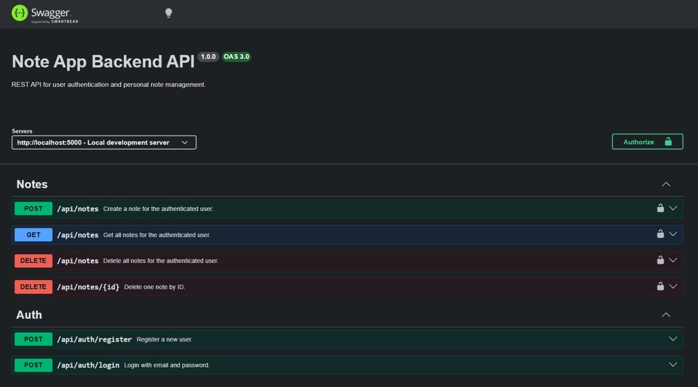

# 📝 Note-Taking API

This API is built to test backend development concepts across different programming languages.  
It uses **JWT Authentication** and a **layered Clean Architecture** with custom exception handling.  
Technologies used in this project include **Node.js**, **Express.js**, and **MongoDB**.

## Tech Stack

<p>
  
  
  
</p>

## Packages

<p>
  <a href="https://www.npmjs.com/package/express"></a>
  <a href="https://www.npmjs.com/package/mongoose"></a>
  <a href="https://www.npmjs.com/package/jsonwebtoken"></a>
  <a href="https://www.npmjs.com/package/bcryptjs"></a>
  <a href="https://www.npmjs.com/package/dotenv"></a>
  <a href="https://www.npmjs.com/package/swagger-jsdoc"></a>
  <a href="https://www.npmjs.com/package/swagger-ui-express"></a>
  <a href="https://www.npmjs.com/package/nodemon"></a>
</p>

## API Documentation (Swagger)

Interactive API docs are available at `http://localhost:5000/api-docs` after running the server.

<p align="center">
  
</p>

## API Endpoints

### Auth

| Method | Endpoint | Description | Auth |
|--------|----------|-------------|------|
| POST | `/api/auth/register` | Register a new user | ❌ |
| POST | `/api/auth/login` | Login and receive JWT token | ❌ |

### Notes

| Method | Endpoint | Description | Auth |
|--------|----------|-------------|------|
| POST | `/api/notes` | Create a new note | ✅ |
| GET | `/api/notes` | Get all your notes | ✅ |
| DELETE | `/api/notes/:id` | Delete a specific note | ✅ |
| DELETE | `/api/notes` | Delete all your notes | ✅ |

**Authorization header format:**
```
Authorization: Bearer <your_token>
```

## Project Structure

```text
note-app-backend
│   server.js
│
└───src
    ├───config
    │       db.js
    │       swagger.js
    │
    ├───errors
    │       customErrors.js
    │
    ├───middlewares
    │       authMiddleware.js
    │       errorMiddleware.js
    │
    ├───models
    │       User.js
    │       Note.js
    │
    ├───services
    │       authService.js
    │       noteService.js
    │
    ├───controllers
    │       authController.js
    │       noteController.js
    │
    ├───routes
    │       authRoutes.js
    │       noteRoutes.js
    │
    ├───utils
    │       catchAsync.js
    │
    └───app.js
```

## Environment Variables

Before running the app, create a `.env` file in the project root:

```env
PORT=5000
MONGO_URI=mongodb://localhost:27017/noteapp
JWT_SECRET=your_jwt_secret_here
```

## Installation

1. Clone the repository:  
   `git clone https://github.com/MegrurNiftiyev/note-app-backend.git`

2. Install dependencies:  
   `npm install`

3. Set up environment variables:  
   `cp .env.example .env`

4. Run the application:  
   `npm run dev`

## Error Responses

All errors return a consistent JSON format:

```json
{
  "status": "fail",
  "message": "Descriptive error message here"
}
```

| Status | Meaning |
|--------|---------|
| 400 | Bad request / validation error |
| 401 | Unauthorized (missing or invalid token) |
| 403 | Forbidden (not your resource) |
| 404 | Not found |
| 409 | Conflict (e.g. email already exists) |
| 500 | Internal server error |

## License

MIT
